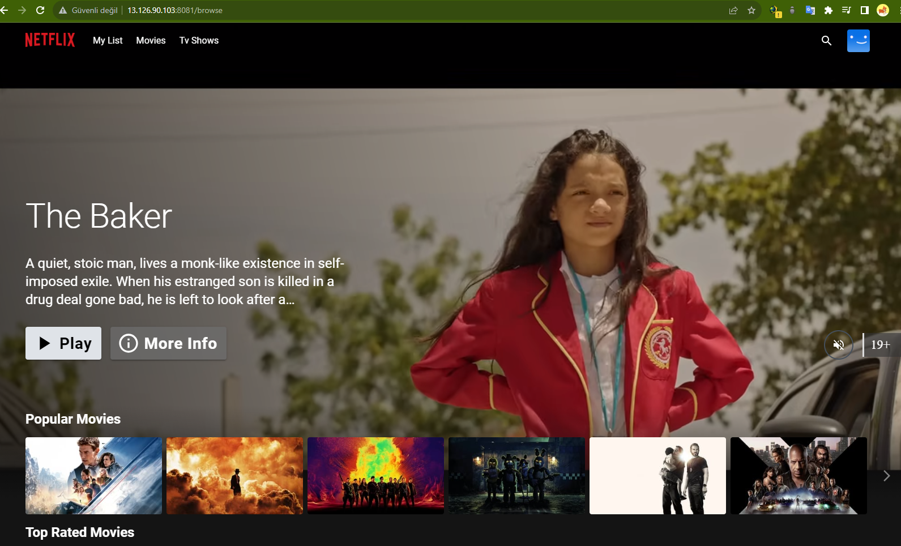
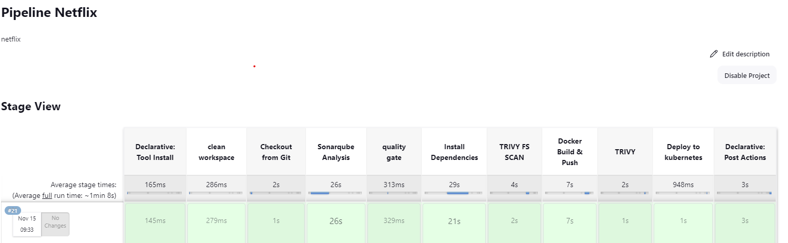
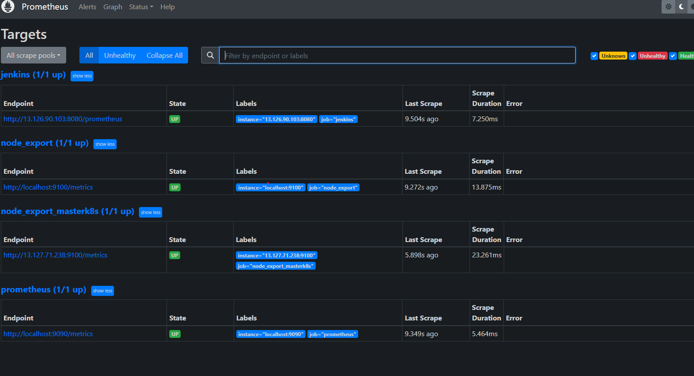
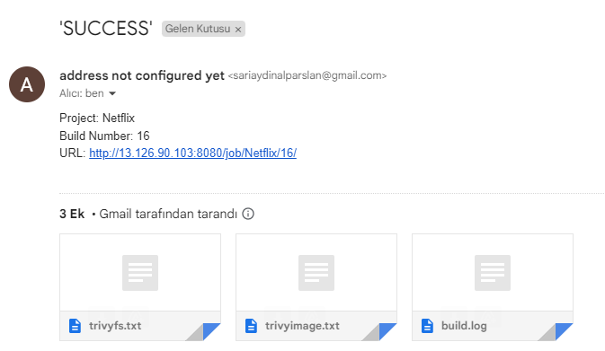

# Netflix Clone

# Result

<h1 align="center">
  
</h1>

# Pipeline

<h1 align="center">
  
</h1>

# Prometheus-View

<h1 align="center">
  
</h1>

# E-mail-Result

<h1 align="center">
  
</h1>

# Dockerfile

```
FROM node:16.17.0-alpine as builder
WORKDIR /app
COPY ./package.json .
COPY ./yarn.lock .
RUN yarn install
COPY . .
ARG TMDB_V3_API_KEY
ENV VITE_APP_TMDB_V3_API_KEY=${TMDB_V3_API_KEY}
ENV VITE_APP_API_ENDPOINT_URL="https://api.themoviedb.org/3"
RUN yarn build

FROM nginx:stable-alpine
WORKDIR /usr/share/nginx/html
RUN rm -rf ./*
COPY --from=builder /app/dist .
EXPOSE 80
ENTRYPOINT ["nginx", "-g", "daemon off;"]

```

# Jenkins-Plugins

```
sonarqube
docker full
OWASP Dependency-Check
temurin
nodejs
prometheus
k8s
email
```

# FullPipeline

```

pipeline{
    agent any
    tools{
        jdk 'jdk17'                                                                                     #install tools
        nodejs 'node16'
    }
    environment {
        SCANNER_HOME=tool 'sonar-scanner'                                                                       #whatever you saved in the tools
    }
    stages {
        stage('clean workspace'){
            steps{
                cleanWs()
            }
        }
        stage('Checkout from Git'){
            steps{
                git branch: 'main', url: 'https://github.com/Aj7Ay/Netflix-clone.git'
            }
        }
        stage("Sonarqube Analysis "){
            steps{
                withSonarQubeEnv('sonar-server') {                                                              #whatever you saved in the system settings
                    sh ''' $SCANNER_HOME/bin/sonar-scanner -Dsonar.projectName=Netflix \
                    -Dsonar.projectKey=Netflix '''
                }
            }
        }
        stage("quality gate"){
           steps {
                script {
                    waitForQualityGate abortPipeline: false, credentialsId: 'Sonar-token'                       #whatever you saved in the credentials
                }
            }
        }
        stage('Install Dependencies') {
            steps {
                sh "npm install"
            }
        }
        stage('OWASP FS SCAN') {
            steps {
                dependencyCheck additionalArguments: '--scan ./ --disableYarnAudit --disableNodeAudit', odcInstallation: 'DP-Check'                 #whatever you saved in the tools
                dependencyCheckPublisher pattern: '**/dependency-check-report.xml'
            }
        }
        stage('TRIVY FS SCAN') {
            steps {
                sh "trivy fs . > trivyfs.txt"
            }
        }
        stage("Docker Build & Push"){
            steps{
                script{
                   withDockerRegistry(credentialsId: 'docker', toolName: 'docker'){
                       sh "docker build --build-arg TMDB_V3_API_KEY=AJ7AYe14eca3e76864yah319b92 -t netflix ."               #your api key
                       sh "docker tag netflix sariaydinalparslan/netflix:latest "                                           #your docker
                       sh "docker push sariaydinalparslan/netflix:latest "
                    }
                }
            }
        }
        stage("TRIVY"){
            steps{
                sh "trivy image sariaydinalparslan/netflix:latest > trivyimage.txt"
            }
        }
        stage('Deploy to kubernets'){
            steps{
                script{
                    dir('Kubernetes') {
                        withKubeConfig(caCertificate: '', clusterName: '', contextName: '', credentialsId: 'k8s', namespace: '', restrictKubeConfigAccess: false, serverUrl: '') {
                                sh 'kubectl apply -f deployment.yml'
                                sh 'kubectl apply -f service.yml'
                        }
                    }
                }
            }
        }

    }
    post {
     always {
        emailext attachLog: true,
            subject: "'${currentBuild.result}'",
            body: "Project: ${env.JOB_NAME}<br/>" +
                "Build Number: ${env.BUILD_NUMBER}<br/>" +
                "URL: ${env.BUILD_URL}<br/>",
            to: 'sariaydinalparslan@gmail.com',                                                               #your email
            attachmentsPattern: 'trivyfs.txt,trivyimage.txt'
        }
    }
}
```
