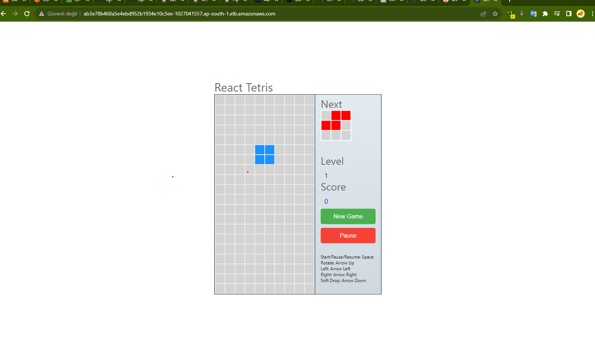
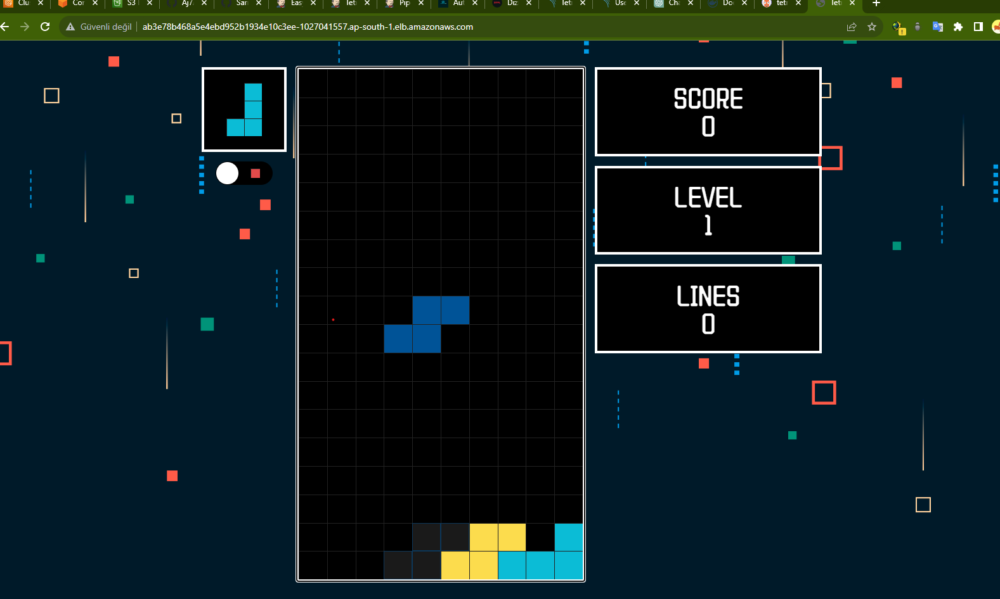

# Tetris

# Result-Version1

<h1 align="center">
  
</h1>

# Result-Version2

<h1 align="center">
  
</h1>

# Jenkins-Plugins

terraform
temurin
owasp
sonarqube
docker full

# FullPipeline

```
pipeline {
    agent any
    tools{
        jdk 'jdk17'
        nodejs 'node16'
    }
    environment {
        SCANNER_HOME=tool 'sonar-scanner'
        GIT_REPO_NAME = "pipeline-tetris"
        GIT_USER_NAME = "SariaydinAlparslan"
      }
    stages {
        stage('checkout') {
            steps {
               git branch: 'main', url: 'https://github.com/Aj7Ay/Tetris-V1.git'
            }
        }
        stage('sonar analyis') {
            steps {
                withSonarQubeEnv('sonar-server') {
                    sh ''' $SCANNER_HOME/bin/sonar-scanner -Dsonar.projectName=Tetris \
                    -Dsonar.projectKey=Tetris '''
                }
            }
        }
        stage('QG') {
            steps {
               script{
                   waitForQualityGate abortPipeline: false, credentialsId: 'Soonar-token'
               }
            }
        }
        stage('NPM') {
            steps {
               sh 'npm install'
            }
        }
        stage('trıvyfs') {
            steps {
               sh 'trivy fs . > trivyfs.txt'
            }
        }
        stage('OWASP FS SCAN') {
            steps {
                dependencyCheck additionalArguments: '--scan ./ --disableYarnAudit --disableNodeAudit', odcInstallation: 'DP-Check'
                dependencyCheckPublisher pattern: '**/dependency-check-report.xml'
            }
        }
        stage('Docker build and push') {
            steps {
               script{
                   withDockerRegistry(credentialsId: 'docker', toolName: 'docker') {
                    sh '''
                    docker build -t tetriscicd .
                    docker tag tetriscicd sariaydinalparslan/tetriscicd:latest
                    docker push sariaydinalparslan/tetriscicd:latest
                    '''
                    }
               }
            }
        }
        stage('trıvyf image') {
            steps {
               sh 'trivy image sariaydinalparslan/tetriscicd:latest > trivyimage.txt'
            }
        }
        stage('checkoutManifest') {
            steps {
               git branch: 'main', url: 'https://github.com/SariaydinAlparslan/pipeline-tetris.git'
            }
        }
        stage('Update Deployment File') {
             steps {
                script {
                    withCredentials([string(credentialsId: 'github', variable: 'GITHUB_TOKEN')]) {
                        NEW_IMAGE_NAME = "sariaydinalparslan/tetriscicd:latest"
                        sh "sed -i 's|image: .*|image: $NEW_IMAGE_NAME|' deployment.yml"
                        sh 'git add deployment.yml'
                        sh "git commit -m 'Update deployment image to $NEW_IMAGE_NAME'"
                        sh "git push https://${GITHUB_TOKEN}@github.com/${GIT_USER_NAME}/${GIT_REPO_NAME} HEAD:main"
                    }
                }
            }
        }
    }
}

```
