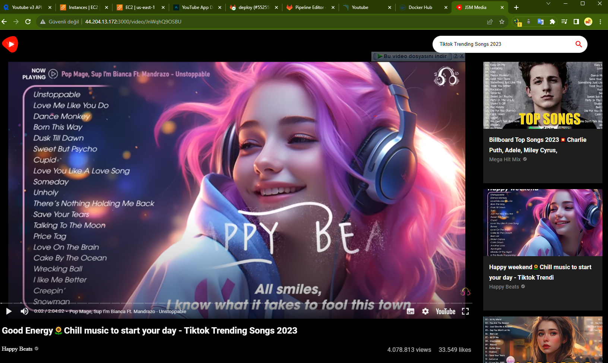

# Build and Deploy a Modern YouTube Clone Application in React JS with Material UI 5



https://mrcloudbook.hashnode.dev/youtube-app-deployment-with-gitlab-cicd

### ✨ SG Port ✨

22 80 8080 3000 9000

### ✨ Dockerfile ✨

FROM node:16

WORKDIR /app

COPY package\*.json ./

RUN npm install

COPY . .

RUN npm run build

EXPOSE 3000

CMD ["npm", "start"]

# FullPipeline Gitlab

```
stages:
    - npm
    - sonar
    - trivy file scan
    - docker
    - trivy image scan
    - run container
Install dependecy:
    stage: npm    
    image:
        name: node:16
    script:
        - npm install
sonarqube-check:
  stage: sonar
  image: 
    name: sonarsource/sonar-scanner-cli:latest
    entrypoint: [""]
  variables:
    SONAR_USER_HOME: "${CI_PROJECT_DIR}/.sonar"  # Defines the location of the analysis task cache
    GIT_DEPTH: "0"  # Tells git to fetch all the branches of the project, required by the analysis task
  cache:
    key: "${CI_JOB_NAME}"
    paths:
      - .sonar/cache
  script: 
    - sonar-scanner
  allow_failure: true
  only:
    - main
Trivy file scan:
  stage: trivy file scan
  image:
    name: aquasec/trivy:latest
    entrypoint: [""]
  script:
    - trivy fs .
Docker build and push:
  stage: docker
  image:
    name: docker:latest
  services:
    - docker:dind   
  script:
    - docker build --build-arg REACT_APP_RAPID_API_KEY=75130076f4msh96056e900ba4a7dp1863b9jsne71121493ff8 -t youtubev3 .    
    - docker tag youtubev3 sariaydinalparslan/youtubev3:latest
    - docker login -u $DOCKER_USERNAME -p $DOCKER_PASSWORD
    - docker push sariaydinalparslan/youtubev3:latest

Scan image:
  stage: trivy image scan
  image:
    name: aquasec/trivy:latest
    entrypoint: [""]
  script:
    - trivy image sariaydinalparslan/youtubev3:latest
deploy:
  stage: run container
  tags:
    - youtube        #use your own tags 
  script:
    - sudo docker run -d --name youtube -p 3000:3000 sariaydinalparslan/youtubev3:latest


```
[GitHub](https://github.com/SariaydinAlparslan/pipeline-projects/blob/main/youtube-clone-app/.gitlab-ci.yml)
